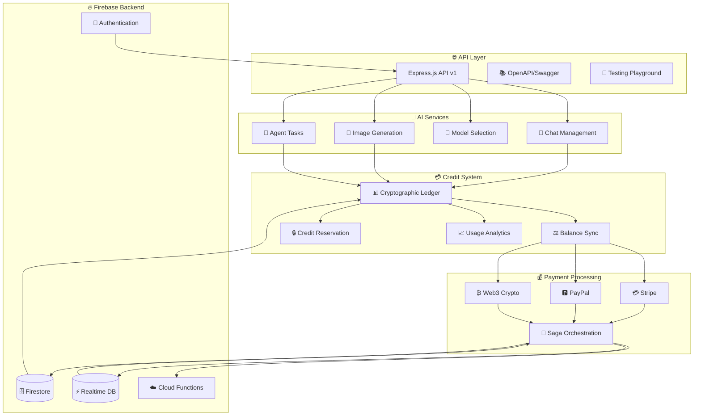
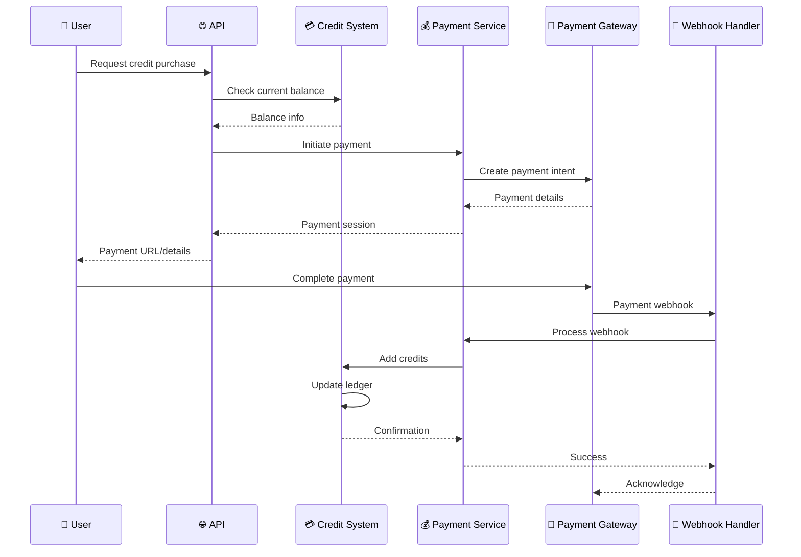
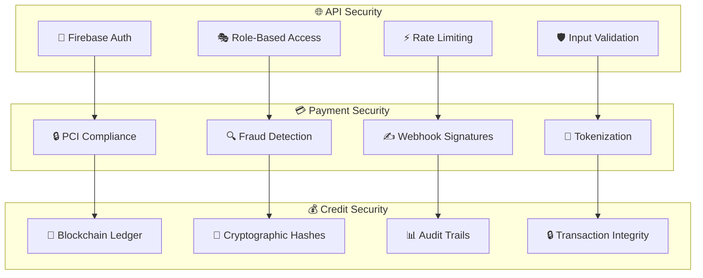

# 🤖 Integrated Credit System API
### AI Assistant with Credit-Based Payment System

> A production-ready, serverless AI assistant platform with blockchain-grade credit management and multi-payment gateway integration. Built with Firebase Functions, TypeScript, and modern AI frameworks.

---

## 🌟 What Makes This Special?

🎯 **Smart AI Assistant** - Multi-model conversations, image generation, and autonomous agent tasks  
💳 **Blockchain-Style Credits** - Immutable ledger with cryptographic security  
💰 **Universal Payments** - Traditional (Stripe/PayPal) + Web3 (Bitcoin, Ethereum, etc.)  
🔐 **Enterprise Security** - Firebase Auth + role-based permissions + rate limiting  
⚡ **Real-time Everything** - Live balance updates, payment tracking, and AI progress  
🧪 **Battle-tested** - 290+ automated tests with 85%+ coverage  

---

## 🏗️ System Architecture



---

## 🚀 Quick Start Guide

### 📋 Prerequisites
```bash
✅ Node.js 18+
✅ Firebase CLI: npm install -g firebase-tools
✅ Java 11+ (for emulators)
✅ Git
```

### ⚡ Installation
```bash
# 1️⃣ Clone & Navigate
git clone <your-repo>
cd functions

# 2️⃣ Install Dependencies
npm install

# 3️⃣ Environment Setup
cp .env.example .env
# Edit .env with your keys 🔑

# 4️⃣ Start Development
npm run serve    # 🔥 Start Firebase emulators
npm test         # 🧪 Run all tests
npm run build    # 🏗️ Build for production
```

### 🔑 Environment Variables
```bash
# 🤖 AI Platform
AI_PLATFORM_API_KEY=your_nebius_api_key
AI_PLATFORM_BASE_URL=https://api.studio.nebius.com

# 💳 Payment Gateways
STRIPE_SECRET_KEY=sk_test_...
STRIPE_WEBHOOK_SECRET=whsec_...
PAYPAL_CLIENT_ID=your_paypal_client_id
PAYPAL_CLIENT_SECRET=your_paypal_secret

# 🔐 Security
LEDGER_SIGNING_KEY=your_crypto_signing_key
WELCOME_BONUS_AMOUNT=1000
```

---

## 📊 Feature Status Dashboard

### ✅ **Production Ready (90% Complete)**

| Component | Status | Features |
|-----------|--------|----------|
| 🤖 **AI Assistant** | ✅ Complete | Multi-model chat, image generation, agent tasks |
| 💳 **Credit System** | ✅ Complete | Blockchain ledger, real-time sync, reservations |
| 💰 **Payments** | ✅ Complete | Stripe, PayPal, Web3 crypto, saga orchestration |
| 🔐 **Security** | ✅ Complete | Firebase Auth, RBAC, rate limiting, validation |
| 🌐 **API Layer** | ✅ Complete | REST endpoints, OpenAPI docs, testing playground |
| 🧪 **Testing** | ✅ Complete | 290+ tests, integration coverage, emulators |

### 🚧 **In Progress**
- 🤖 Advanced agent workflows for complex multi-step tasks
- 📊 Admin dashboard for system monitoring and user management

### 🎯 **Coming Soon**
- 🎨 Frontend React application with real-time updates
- 📱 Mobile app with push notifications
- 🔍 Advanced analytics and business intelligence

---

## 🛠️ Technology Stack

### 🏗️ **Core Infrastructure**
```
🔥 Firebase Functions (Gen 2)    ⚡ Serverless compute platform
📝 TypeScript                    🛡️ Type-safe development
🌐 Express.js                    🚀 Web application framework
🧪 Jest                          ✅ Testing framework
```

### 🤖 **AI & Machine Learning**
```
🦜 LangChain/LangGraph           🧠 AI orchestration framework
🌟 Nebius AI Platform           🎯 Multi-model AI provider
🎨 Image Generation Models      🖼️ FLUX, Stable Diffusion
💬 Chat Models                  🗣️ Llama, Gemma, Claude-style
```

### 🗄️ **Data & Storage**
```
🔥 Firestore                    📊 Document database
⚡ Realtime Database           🔄 Live synchronization
☁️ Cloud Storage               📁 File storage
🔐 Cryptographic Ledger        🛡️ Immutable transactions
```

### 💰 **Payment Systems**
```
💳 Stripe                      💵 Traditional payments
🅿️ PayPal                      🌍 Global payment processing
₿ Web3 Integration             🚀 Cryptocurrency support
🔄 Saga Orchestration          🎯 Distributed transactions
```

### 🔐 **Security & Auth**
```
🔥 Firebase Auth               👤 Identity management
🛡️ RBAC System                🎭 Role-based access control
⚡ Rate Limiting               🚦 API protection
🔒 Input Validation            🛡️ Request sanitization
```

---

## 🎮 API Playground & Documentation

### 🌐 **Interactive API Explorer**
```bash
# Start the development server
npm run serve

# Visit these URLs:
🏠 API Root:           http://localhost:5001/your-project/us-central1/api/v1
📚 Swagger Docs:       http://localhost:5001/your-project/us-central1/api/v1/docs/swagger
🧪 Testing Playground: http://localhost:5001/your-project/us-central1/api/v1/docs/playground
📊 System Status:      http://localhost:5001/your-project/us-central1/api/v1/monitoring/status
```

### 🔗 **Key API Endpoints**

#### 💬 **Chat & AI Assistant**
```http
POST /v1/chat/conversations              # 🆕 Start new conversation
POST /v1/chat/conversations/:id/messages # 💬 Send message to AI
GET  /v1/chat/conversations              # 📋 List conversations
POST /v1/chat/agent-tasks                # 🤖 Create agent task
GET  /v1/chat/agent-tasks/:id            # 📊 Check task status
```

#### 💳 **Credit Management**
```http
GET  /v1/credits/balance                 # 💰 Current balance
GET  /v1/credits/history                 # 📊 Transaction history
POST /v1/credits/reserve                 # 🔒 Reserve credits
POST /v1/credits/welcome-bonus           # 🎁 Claim welcome bonus
GET  /v1/credits/analytics               # 📈 Usage analytics
```

#### 🎨 **Image Generation**
```http
POST /v1/images/generate                 # 🎨 Generate image
GET  /v1/images/generate/:taskId         # 📊 Check generation status
GET  /v1/images                          # 🖼️ List generated images
DELETE /v1/images/:imageId               # 🗑️ Delete image
```

#### 💰 **Payment Processing**
```http
GET  /v1/payments/options                # 💳 Payment methods & packages
POST /v1/payments/traditional            # 💵 Stripe/PayPal payment
POST /v1/payments/crypto                 # ₿ Cryptocurrency payment
GET  /v1/payments/status/:id             # 📊 Payment status
GET  /v1/payments/history                # 📋 Payment history
```

#### 🧠 **AI Models**
```http
GET  /v1/models                          # 🤖 Available AI models
GET  /v1/models/preferences              # ⚙️ User preferences
PUT  /v1/models/preferences              # 🔧 Update preferences
POST /v1/models/estimate-cost            # 💰 Cost estimation
```

---

## 📁 Project Structure

```
functions/
├── 📂 src/
│   ├── 🌐 api/                       # REST API Layer
│   │   ├── 🛡️ middleware/            # Auth, validation, security
│   │   └── 📋 v1/                    # API v1 endpoints
│   │       ├── 💬 chat.ts            # Chat & conversations
│   │       ├── 💳 credits.ts         # Credit management
│   │       ├── 🎨 images.ts          # Image generation
│   │       ├── 🧠 models.ts          # AI model management
│   │       ├── 💰 payments.ts        # Payment processing
│   │       ├── 📚 docs.ts            # API documentation
│   │       └── 📊 monitoring.ts      # Health & metrics
│   │
│   ├── 🎯 features/                  # Business Logic
│   │   ├── 🤖 ai-assistant/          # AI orchestration
│   │   │   ├── 🧠 services/          # LangChain integration
│   │   │   └── 🎯 types/             # AI-specific types
│   │   ├── 💳 credit-system/         # Credit management
│   │   │   ├── 📊 services/          # Ledger & balance sync
│   │   │   └── 🔐 types/             # Credit types
│   │   └── 💰 payment-processing/    # Payment systems
│   │       ├── 💳 services/          # Stripe, PayPal, Web3
│   │       ├── 🔄 events/            # Webhook handling
│   │       └── 🛡️ utils/             # Payment utilities
│   │
│   ├── 🔧 shared/                    # Shared Infrastructure
│   │   ├── 🎭 orchestration/        # Saga patterns & event bus
│   │   ├── 📊 observability/        # Logging & metrics
│   │   ├── 🔐 types/                 # TypeScript definitions
│   │   └── 🛠️ utils/                 # Common utilities
│   │
│   ├── ☁️ functions/                 # Cloud Functions
│   │   ├── 👤 user-lifecycle.ts     # User management
│   │   ├── 💳 credit-events.ts      # Credit processing
│   │   ├── 💰 payment-events.ts     # Payment webhooks
│   │   └── 🤖 agent-execution.ts    # AI agent tasks
│   │
│   ├── 🏗️ app.ts                    # Express app setup
│   └── 🚀 index.ts                  # Firebase Functions entry
│
├── 🧪 test/                          # Test Suite (290+ tests)
│   ├── 🌐 api/                       # API integration tests
│   ├── 🎯 features/                  # Feature unit tests
│   └── 🔧 shared/                    # Shared component tests
│
├── 📦 package.json                   # Dependencies & scripts
├── 🔧 tsconfig.json                  # TypeScript config
├── 🧪 jest.config.js                 # Test configuration
└── 📚 README.md                      # This file
```

---

## 🧪 Testing & Quality Assurance

### 📊 **Test Coverage Dashboard**
```
🎯 Total Tests: 290+
📈 Coverage: 85%+
⚡ Test Types: Unit, Integration, E2E
🔥 Emulators: Firebase suite integration
```

### 🧪 **Test Categories**

| Category | Tests | Coverage | Description |
|----------|-------|----------|-------------|
| 🌐 **API Tests** | 45+ | 90% | REST endpoints, auth, validation |
| 💳 **Credit System** | 60+ | 95% | Ledger, transactions, sync |
| 💰 **Payments** | 80+ | 88% | Stripe, PayPal, Web3, sagas |
| 🤖 **AI Assistant** | 50+ | 85% | Chat, images, model selection |
| 🔐 **Security** | 35+ | 92% | Auth, RBAC, rate limiting |
| 🔧 **Infrastructure** | 20+ | 80% | Utils, orchestration, events |

### 🚀 **Running Tests**
```bash
# 🧪 Run all tests
npm test

# 🎯 Run specific test suites
npm test -- --testPathPattern="api"           # API tests only
npm test -- --testPathPattern="credit"        # Credit system tests
npm test -- --testPathPattern="payment"       # Payment tests

# 📊 Generate coverage report
npm run test:coverage

# 🔥 Test with Firebase emulators
npm run test:emulators
```

---

## 💰 Payment Flow Architecture

### 🔄 **Payment Processing Flow**


### 🌐 **Web3 Payment Flow**

```mermaid
graph LR
    A[👤 User] --> B[🔗 Connect Wallet]
    B --> C[💰 Estimate Cost]
    C --> D[⛽ Gas Estimation]
    D --> E[📝 Create Transaction]
    E --> F[✍️ Sign Transaction]
    F --> G[📡 Broadcast to Network]
    G --> H[⏳ Monitor Confirmations]
    H --> I[✅ Credit Account]
    I --> J[📊 Update Balance]
```


---

## 🔐 Security & Compliance

### 🛡️ **Multi-Layer Security Architecture**


### 🔑 **Authentication & Authorization**
- 🔥 **Firebase Auth**: Multi-provider identity management
- 🎭 **RBAC System**: Role-based access control with permissions
- 🔐 **JWT Tokens**: Secure token-based authentication
- ⚡ **Rate Limiting**: Per-user API protection
- 🛡️ **Input Validation**: Request sanitization and validation

### 💳 **Payment Security**
- 🔒 **PCI DSS Compliant**: Industry-standard payment security
- 🔍 **Fraud Detection**: Real-time risk assessment
- ✍️ **Webhook Verification**: Cryptographic signature validation
- 🏦 **Secure Tokenization**: No sensitive data storage
- 📊 **Audit Logging**: Complete transaction history

### 🔗 **Blockchain-Style Ledger**
- 🔐 **Cryptographic Hashes**: Immutable transaction records
- 🔗 **Hash Chains**: Tamper-evident transaction linking
- ✍️ **Digital Signatures**: Transaction authenticity verification
- 📊 **Audit Trails**: Complete transaction history
- 🔒 **Integrity Validation**: Real-time tamper detection

---

## 📈 Monitoring & Observability

### 📊 **Real-time Dashboards**
```bash
# 🏠 System Health
GET /v1/monitoring/health          # Overall system status
GET /v1/monitoring/metrics         # Performance metrics
GET /v1/monitoring/info           # System information

# 📊 Business Metrics
GET /v1/credits/analytics         # Credit usage analytics
GET /v1/payments/analytics        # Payment performance
GET /v1/models/analytics          # AI model usage
```

### 🔍 **Key Metrics Tracked**
- ⚡ **Performance**: API response times, function execution duration
- 💰 **Business**: Revenue, credit consumption, user engagement
- 🔐 **Security**: Failed auth attempts, rate limit hits, fraud detection
- 🤖 **AI Usage**: Model selection, generation times, success rates
- 💳 **Payments**: Success rates, processing times, provider performance
- 🔗 **Blockchain**: Gas fees, confirmation times, network status

### 🚨 **Alerting & Notifications**
- 🔥 **System Issues**: Automatic alerts for service degradation
- 💰 **Payment Failures**: Real-time payment processing alerts
- 🔐 **Security Events**: Suspicious activity notifications
- 📊 **Business Metrics**: Revenue and usage threshold alerts

---

## 🚀 Deployment & Production

### 🏗️ **Build & Deploy**
```bash
# 🔨 Build for production
npm run build

# 🚀 Deploy to Firebase
firebase deploy --only functions

# 🧪 Deploy with testing
npm run deploy:test

# 📊 Check deployment status
firebase functions:log
```

### 🌍 **Environment Configuration**
```bash
# 🔧 Set production environment variables
firebase functions:config:set \
  ai.api_key="your_production_key" \
  stripe.secret_key="sk_live_..." \
  paypal.client_id="live_client_id"

# 📊 View current config
firebase functions:config:get
```

### 📊 **Production Monitoring**
- 🔥 **Firebase Console**: Function logs and performance
- 📈 **Custom Metrics**: Business and technical KPIs
- 🚨 **Alerting**: Automated incident response
- 📊 **Analytics**: User behavior and system usage

---

## 🤝 Contributing

### 📋 **Development Guidelines**
1. 🧪 **Testing**: Maintain 85%+ test coverage
2. 📝 **TypeScript**: Strict type safety required
3. 🔐 **Security**: Follow security best practices
4. 📚 **Documentation**: Update docs for new features
5. 🎯 **Clean Code**: Follow established patterns

### 🔄 **Development Workflow**
```bash
# 1️⃣ Create feature branch
git checkout -b feature/your-feature

# 2️⃣ Make changes with tests
npm test

# 3️⃣ Build and validate
npm run build

# 4️⃣ Commit and push
git commit -m "feat: your feature description"
git push origin feature/your-feature

# 5️⃣ Create pull request
```

---

## 📄 License & Acknowledgments

### 📜 **License**
This project is proprietary and confidential. All rights reserved.

### 🙏 **Open Source Dependencies**
- 🦜 **LangChain/LangGraph** - AI orchestration framework
- 🔥 **Firebase** - Backend-as-a-Service platform
- 📝 **TypeScript** - Type-safe JavaScript
- 🌐 **Express.js** - Web application framework
- 🧪 **Jest** - Testing framework
- 💳 **Stripe SDK** - Payment processing
- 🅿️ **PayPal SDK** - Payment processing

---

<div align="center">

### 🚀 **Built with Modern Technologies**

**Serverless** • **TypeScript** • **Firebase** • **AI-Powered** • **Blockchain-Inspired**

*Engineered for scale, security, and developer experience* ⚡

</div>